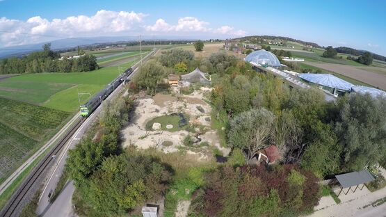
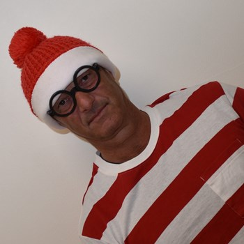
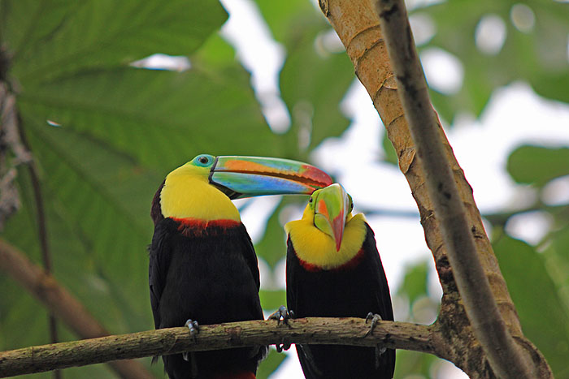

+++
title = "Aus Glut und Asche für der Naturs Erbe."
date = "2024-02-26"
draft = false
pinned = false
image = "papiliorama_kerzers11-8836711a.jpg"
description = "Eine Reportage über das Papiliorama und seine Geschichte. Eine spannende Reise durch die Vergangenheit bis zur Gegenwart."
footnotes = "Bildquellen:\n\n(https://Murten.unsereregion.ch/assets/images/b/Papiliorama_Kerzers11-8836711a.jpg)(https://www.willkommeninbiel.ch/deine-bieler-kollegen/lorenz-schl%C3%A4fli-1475)(https://www.beatenbergbilder.ch/bildergruss/2010/07_ausflüge/img_1296_k_700.jpg Stand: 13.5.2010)"
+++

1988 aus Leidenschaft geboren, 1995 vom Inferno verschluckt und mit vereinter Kraft wieder aus dem Boden gestampft: Ein Rundgang durch die unglaubliche Geschichte des Papiliorama.


“Papiliorama” prangt oberhalb des Eingangs, der durch einen Holzsteg erreichbar ist. Die Stiftung steht in Kerzers erst seit 1995. Zuvor befand sie sich in Marin (NE). Am Rumpf eines Silos haften Aufdrucke der Projekte und Tochterfirmen der Stiftung, fast 400 Km2 In Belize. In Mittelamerika setzt die Stiftung sich mit anderen Zoos für den Tropenschutz und Bewahrung der Biodiversität ein und sensibilisiert die jüngeren Generationen zu diesen Themen. Hinter der Drehtür erblickt man die ersten Tiere, Primaten, tropische Singvögel und Reptilien in einem Gehege, wie ein Ökosystem. Die Idee ergab sich im Verstand von Maarten Bijleveld van Lexmond, einem aviden Biologen aus den Niederlande, welcher mit seiner Frau 1988 das Papiliorama in Neuenburg gründete. Nach Ticketausgabe eröffnet sich einem das ganze Ausmaß der Stiftung, Drei Ausstellungen, Die Schmetterlingsvoliere, 1200 m2  mit über 1000 Schmetterlingen, Das Nocturama, eine Halle mit einer um 12 Stunden verschobenen Beleuchtung um die Süd und mittelamerikanischen Bewohner in aktiven Zustand zu bestaunen  und Der Jungle Track, detailgetreu nach der Flora und Fauna in Belize, Zusammen mit den Außenanlagen bilden diese Ausstellungen Das dritte Papiliorama. 

Das Erste ging in Rauch auf.

Und das zweite…. Das ist eine längere Geschichte.

### Jeder fängt mal klein an.

Die erste Ausstellung hier ist die berüchtigten Schmetterlingsvoliere, berüchtigt, da die erste Ausstellung in Marin genau das gleiche war, und hier beginnt auch die kleine Führung mit Projektmanager und Wo ist Walter Enthusiast:  Lorenz Schläfli...

Doch zuerst etwas Hintergrundinformation: 

1988 Das Gründungsjahr des Papiliorama, Maarten Bijleveld van Lexmond und seine Frau Catherine gründeten das erste Papiliorama als eine Ag aufgrund dessen das die Finanzierung des Papilioramas nicht voll von ihnen getragen werden konnte und sie auf Kredite zurückgreifen mussten. Die Stiftung selbst wurde 1989 gegründet, nachdem sich klargemacht hat, dass viele am Tropenhaus interessiert und bereit waren, Eintritt zu bezahlen, um die wundersamen Ausstellungen zu bestaunen. Die Stiftung begann mit demselben Traum wie sie heute noch weitergeführt wird.

> «Unser Stiftungszweck ist es Jugendlichen, die Schönheit der Natur näher zu bringen…»
>
> (Lorenz Schläfli)

### Taten statt Worte.

In dieser Halle sieht man die Faszination des Gründers mit den Tropen und versteht, warum das Papiliorama zahlreiche Projekte in Mittelamerika eröffnet hat. Das Papiliorama öffnete seine Tore im selben Jahr wie der Royal Burger’s Zoo in den Niederlanden und zusammen entschieden die beiden Zoos je eine gleichnamige Schwester Stiftung zu eröffnen, die sich mit dem Bewahren der Natur in Mittelamerika befasst. So entstanden die beiden ITCF Stiftungen, von welchen die vom Papiliorama gegründete 1989  im Nordosten von Belize in Zentralamerika ein riesiges Grundstück erwarb und das Shipstern-Naturreservat gründete. Dies ist auch heute noch das Hauptprojekt der ITCF. Die sogenannte ITCF wurde 1989, ein Jahr nach der eigentlichen Stiftung, gegründet. Das Reservat umfasst ca. 110 km2 und zeichnet sich durch seine vielfältigen Lebensräume aus, die von Lagunen und Mangroven über trockene Küstenwälder bis hin zu den für die Yucatan-Halbinsel typischen subtropischen Wäldern reichen. 



Shipstern-Naturreservat

Das Gebiet des Shipstern-Naturreservat wurde 1989, im Nordosten von Belize, von ITCF erworben. Das Reservat erstreckt sich  über eine Fläche von 110 km2 und ist geprägt von seinen Zahlreichen Lebensräumen, die sich von Lagunen, Mangroven, über trockene Küstenwälder bis hin zu für den Yucatan-Halbinsel typischen Subtropischen Wäldern reichen. 

Das Shipstern-Reservat wird von der CSFI verwaltet, einer von der ITCF gegründeten NGO. Hierbei steht NGO für Non-Governmental Organisation. Finanziert wird CSFI überwiegend von ITCF.


### Naturschutz nach Plan.

Die nächste Szenerie befindet sich in einer düsteren Voliere. Ein Turm ragt aus der Mitte der Halle empor, um welchen sich Wasser wiegt, das auf erstes Betrachten mehr an Tinte erinnert, würde man nicht das irisierende Flimmern von Schuppen wahrnehmen, während sich Fledermäuse kreisend in der Kuppel tummeln: das Nocturama. 

Hier befinden sich nachtaktive Bewohner der Mittelamerikanischen Tropen und auch Einheimische nocturne Säuger, wie der Siebenschläfer oder das Große Mausohr und auch ein bedrohter Säuger der sich von Ast zu Ast klammert. In ganz Europa beteiligen sich zahlreiche Wildparks und Zoos an der Erhaltung der Artenvielfalt, was von der European Association of Zoos and Aquaria (EAZA) kontrolliert und durch Züchtung bestimmter Tiere in verschiedenen Zoos erreicht wird. Das Papiliorama beteiligt sich an diesem Unternehmen mit der Zucht von Greifschwanzstachler, welche nach der Aussage eines Guides aussehen wie:

> «Eine Kreuzung zwischen Stacheltier und Opossum»
>
> ( Freiburghaus Iris )

In diesem Abschnitt war einmal auch ein Ozelot zu sehen, jedoch wurde dieses an einen anderen Zoo abgegeben, um dort ein Junges zu züchten, nachdem im Papiliorama eines geboren wurde. 

### Detailgetreu bis ins Unkraut.

Die hinterste Halle der gesamten Anlage ist der Jungle Track. Hier befindet man sich in einer detailgetreuen Rekreation der Flora und Fauna der Naturschutzgebiete in Belize. Jede Pflanze und jedes Tier in dieser Halle ist entweder aus Botanischen Institutionen, Zoos oder direkt aus Belize eingeführt, Natur schonend natürlich. Um auch die Baumkronen bestaunen zu können, ist ein Laufsteg über zwei Wendeltreppen zu erreichen und um die Natur hautnah zu erleben, laufen die meisten Tiere frei umher. In dieser Halle befindet sich auch  ein Plethora mit Informationen über die Tochter Stiftung des Papillio Ramas und ihre insgesamt beinahe 400m. Unter dieser grösse können die Tiere ihrem natürlichen Lebensraum sehr nahe kommen mit dem Unterschied, dass sie vor jeglichen Gefahren geschützt und bei einer Erkrankung fachgerecht behandelt werden.

### Durch Feuer und Flamme 

Diese Drei Kuppeln bilden das Herzstück des Papilioramas, das schon immer Jung und Alt anzog, jedoch wäre es beinahe nie zu diesem wundersamen Ort gekommen. 1995: 7 Jahre nach der Gründung des Papilioramas, kurz nach Schließung verursacht eine Fehlfunktion einer Kühltruhe einen Kurzschluss, der zur Überhitzung des Kühlelementes führte. Innerhalb kürzester Zeit  stand die gesamte Anlage in einem brausenden Inferno und als die Lösch-Anstrengungen vorüber waren, war kaum noch etwas von der ursprünglichen Anlage zu erkennen. Interessanter Weise überlebten die meisten Schmetterlinge in einem betonierten Putzraum der innerhalb der Kuppel und die Mitarbeiter des Papilioramas fanden die überlebenden Schmetterlinge am nächsten Morgen. 

Nach diesem immensen Rückschlag wurde das Papiliorama in Marin durch eine unerwartete und enorme Solidaritätswelle im selben Jahr wieder aufgebaut, jedoch hatte die Stiftung in Marin nicht mehr viel Platz zur Expansion, weshalb sie nach Kerzers verschoben wurde. So kam es das nun in Kerzers das dritte je existierende Papiliorama steht.

### A Work in Progress...

Das Papiliorama hat seit seiner Gründung 1988 immer an neuem gearbeitet und sich dafür eingesetzt den Naturschutz an die Mittel anzupassen. Selbst nachdem es zu Schutt und Asche reduziert wurde, baute man es wieder auf und machte sich an das nächste Förderprojekt. Selbst jetzt nachdem es sich in Kerzers angesiedelt hat plant man eine expansion, ein neues Jugendprojekt und eine neue Ausstellung nacheinander ohne an das Aufhören zu denken, denn Illegale Abholzung, Wilderei, Umweltverschmutzung und Artensterben rastet nicht aber genau so wenig tut es das Papiliorama. Das Papiliorama wird in Zukunft noch stark wachsen und immer Neues liefern, was zum Staunen und Nachdenken anregt, was aber feststeht ist, dass es interessant wird. Wie das Motivationsschild in Herr Schläflis Büro prangt: Fehler sind für Anfänger, Profis verursachen Katastrophen.